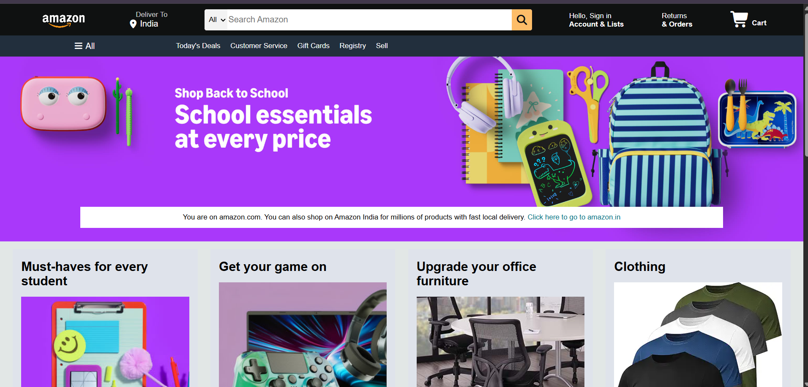

<div align="center">

# 🛒 Amazon Clone

### A modern Amazon-inspired e-commerce website built with HTML & CSS

<p>
  
  
  
</p>

</div>

---

## 📌 About The Project

<p align="center">
  
</p>

This project is a responsive **Amazon Clone** created using **HTML and CSS**.

The goal of this project was to recreate the core visual experience of Amazon's homepage while practicing modern web design concepts, layout techniques, navigation bars, product sections, and responsive UI styling.

---

## ✨ Features

- 🛒 Amazon-inspired navigation bar
- 🔍 Search bar with category selection
- 📍 Delivery location section
- 👤 Account and orders section
- 🛍️ Shopping cart interface
- 🎮 Product category cards
- 💻 Electronics and gaming sections
- 🏠 Hero banner section
- 📱 Clean and structured UI
- 🎨 Amazon-inspired dark theme
- ⚡ Font Awesome icons integration

---

## 🛠️ Tech Stack

| Technology | Usage |
|---|---|
| HTML5 | Website structure |
| CSS3 | Styling and layout |
| Font Awesome | Icons |

---

## 📂 Project Structure

```text
Amazon-Clone/
│
├── index.html
├── style.css
├── AMAZON.png
├── assets/
└── README.md
